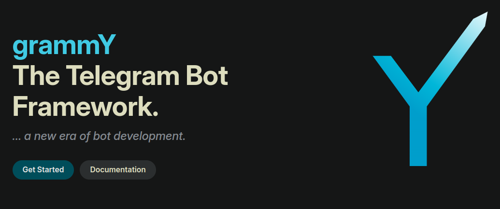

# bot-development-with-grammY



Welcome to **bot-development-with-grammY**! 🚀

This repository is dedicated to my exploration and mastery of the **grammY.js** framework for developing Telegram bots. Here, you’ll find a comprehensive collection of insights, code snippets, and best practices aimed at helping you build powerful, scalable, and feature-rich bots.

## 📚 What You’ll Find Here

- **Code Snippets**: Practical examples and templates for common bot functionalities.
- **Best Practices**: Tips and guidelines for efficient and effective bot development.
- **Experiments**: Personal experiments and explorations with grammY.js.
- **Insights**: Key takeaways and lessons learned from working with grammY.js.

## 🚀 Getting Started

To start using the code and resources in this repository:

1. **Clone the Repository**:
   ```bash
   git clone https://github.com/yourusername/bot-development-with-grammY.git
   ```

2. **Navigate to the Directory**:
   ```bash
   cd bot-development-with-grammY
   ```

3. **Install Dependencies**:
   ```bash
   npm install
   ```

4. **Start Exploring**: Check out the various directories and files to find code snippets, best practices, and more.

## 🔧 Contributing

Contributions are welcome! If you have improvements or new insights to share, please feel free to open an issue or submit a pull request.

## 🌟 Acknowledgments

A big thanks to the grammY.js community for their support and resources. For more detailed documentation and updates, visit the official [grammy.js website](https://grammy.dev/).

## 📬 Contact

For any questions or collaborations, reach out to me via [LinkedIn](https://www.linkedin.com/in/muhammad-sajid-ali-khan-5145b7135/) or [email](sajidrajput01.and@gmail.com).

Happy coding! 💻🤖